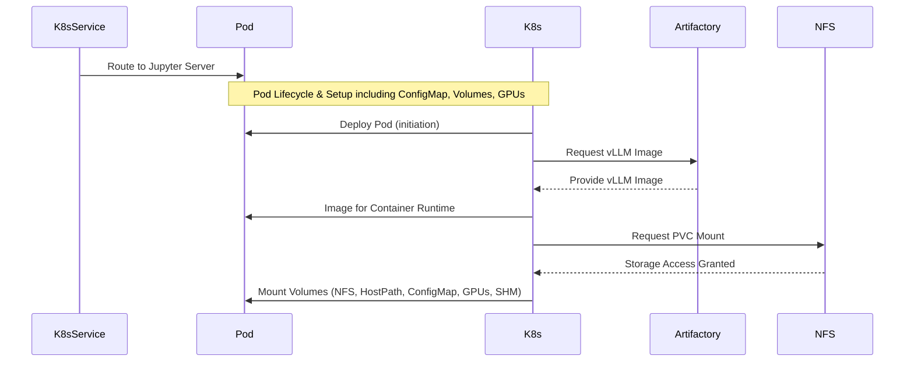

# Jupyter-ML: Multi-GPU vLLM Test Harness

## Project Intent

This project provides a Kubernetes-based development environment harness specifically designed for running multi-GPU vLLM tests using a Jupyter server interface. By default, this environment requests 2 NVIDIA GPUs to enable distributed vLLM experiments and model serving directly within the Jupyter environment.

## Architecture

The test harness integrates several components to provide a streamlined and efficient development environment. The sequence diagram below illustrates the key interactions over time:



**Component Roles:**
*   **Kubernetes Service**: External facing service that routes traffic.
*   **Kubernetes**: Control plane managing pod lifecycle and resources.
*   **Jupyter Pod**: The application runtime environment.
*   **Artifactory**: Source for the application container image.
*   **NFS Server**: Provides persistent shared storage.

**Interaction Flow:**
1.  **User Access**: The user accesses Jupyter through the Kubernetes Service.
2.  **Service Routing**: The Kubernetes Service routes the request to the Jupyter server within the pod.
3.  **Pod Deployment**: Kubernetes initiates the deployment of the Jupyter-vLLM pod.
4.  **Image Pull**: Kubernetes pulls the vLLM image from Artifactory for the pod.
5.  **Volume Mount**: Kubernetes mounts necessary volumes (NFS, HostPath, ConfigMap, allocates GPUs, sets up SHM) into the pod. The pod encapsulates all these components including the Jupyter server, its dependencies, storage, and computational resources.
6.  **Active Usage**: Once running, the user interacts with Jupyter via the service, and the pod utilizes the mounted resources (for fast local execution, dependency management, GPU acceleration, and performance buffering supported by Artifactory and NFS).

## Project Structure

*   `jupyterML/`: Contains all Kubernetes resource definitions managed by Kustomize.
    *   `00-namespace.yaml`: Defines the `jupyter-ml-env` Kubernetes namespace.
    *   `01-nfs-volumes.yaml`: Sets up NFS PersistentVolume and PersistentVolumeClaim for shared storage.
    *   `02-jupyter.yaml`: Defines the core Deployment and Service for the vLLM/Jupyter application.
    *   `03-jupyter-deps-configmap.yaml`: Contains a `pyproject.toml` with base Python dependencies (ipykernel, notebook).
    *   `kustomization.yaml`: The main Kustomize file that aggregates all resources and specifies image patches.
*   `Makefile`: Provides commands for deploying, deleting, and redeploying the Jupyter-ML environment.

## Key Technical Components

*   **Kubernetes & Kustomize**: Orchestrates containerized application deployment and management using Kustomize for configuration.
*   **Jupyter Notebook**: Provides an interactive web-based development environment.
*   **vLLM**: Serves as the high-performance inference engine for large language models, configured for multi-GPU operation.
    *   *Image Note*: The base `vllm/vllm-openai-0.11` image is patched via Kustomize to use `artifactory.guardops.ai/library/vllm-openai-patched:v0.11.0-patch1`.
*   **NFS Storage**: Provides persistent, shared storage for code, models, and caches (`/workspace/jupyter-ml` on the host, `/root/code` in the container).
*   **NVIDIA GPU Support**: Utilizes `nvidia` runtime class and selects a specific node (`nvm-1002`) with GPUs.
*   **Shared Memory (`/dev/shm`)**: Mounted for potential vLLM performance optimizations.

## Prerequisites

*   A running Kubernetes cluster.
*   `kubectl` configured to communicate with the cluster.
*   Kustomize installed (`kustomize build` command available).
*   Appropriate permissions on the Kubernetes cluster to create namespaces, deployments, services, and persistent volumes.
*   An accessible NFS server at `nfs.guardops.ai:/export/nfs` (as configured in `jupyterML/01-nfs-volumes.yaml`).

## How to Run (using Makefile)

The project includes a `Makefile` to simplify common operations.

### Deploy the Environment

To deploy or update the Jupyter-ML environment:

```bash
make deploy
```

This command executes `kubectl apply -k jupyterML`, which applies the Kustomize configuration.

### Accessing Jupyter Notebook

Once deployed, the Jupyter Notebook service will be running.

**Option 1: Using `kubectl port-forward` (Recommended for local access)**

This method tunnels traffic from your local machine to the Jupyter service in the cluster:

```bash
kubectl port-forward -n jupyter-ml-env service/jupyter-ml-svc 8000:8000
```

Then, open your web browser and navigate to `http://localhost:8000`.

**Option 2: Using NodePort**

The service is exposed as a NodePort on `32440`. You can access it via any reachable node IP in your Kubernetes cluster:

```bash
# Replace <NODE_IP> with the actual IP address of one of your Kubernetes nodes
http://<NODE_IP>:32440
```

### Redeploying the Environment

To delete the existing deployment and deploy a fresh instance:

```bash
make redeploy
```

This command runs `make delete` followed by `make deploy`.

### Deleting the Environment

To remove the deployed Jupyter-ML environment:

```bash
make delete
```

This command executes `kubectl delete -k jupyterML`.

## Configuration Highlights

*   **GPU Configuration**: The default deployment (`02-jupyter.yaml`) is configured to use 2 GPUs. This is controlled by the `resources.requests.nvidia.com/gpu` field in the container spec. Adjust this value based on your available GPU resources.
*   **Persistent Storage**: A 256Gi NFS volume is mounted at:
    *   `/root/code` (for Jupyter notebooks and scripts)
    *   `/root/.cache/huggingface/hf-cache` (for Hugging Face model caches).
    *   `/workspace/jupyter-ml` (host path for pip packages and venv).
*   **Dependencies**: Base dependencies (ipykernel==6.31.0, notebook==7.5.0) are installed from the `ConfigMap` into a Python virtual environment located in `/workspace/jupyter-ml/venv`.
*   **vLLM Initialization**: The container initializes vLLM within the Jupyter environment. Specific model loading or vLLM parameters would typically be handled within the Jupyter notebooks/scripts.

---

For more detailed information on individual components, refer to the respective YAML files in the `jupyterML/` directory.
